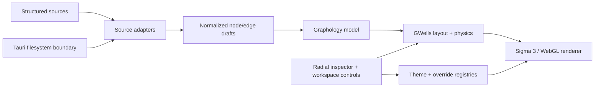

# LumaWeave

LumaWeave is a local-first graph visualization and architecture-mapping application. It turns structured sources into interactive graphs, lays them out with the standalone GWells physics engine, and renders them through a themed Sigma/WebGL workspace.

<!-- OPERATOR: capture a screenshot of the graph workspace showing a loaded graph,
     the minimap, and ideally the radial inspector open on a node. Save to
     docs/assets/screenshot-workspace.png and replace this comment block with:
      -->

The project is in active pre-1.0 development. The current runtime is a desktop-oriented Tauri application with a React frontend and a 2D Sigma renderer. See the [code-verified current status](docs/CURRENT_STATUS.md) for the exact implemented, partial, and planned boundaries.

## What works today

- Interactive Graphology graphs rendered by Sigma 3/WebGL.
- Five custom node materials (`glass-sphere`, `sun`, `crystal`, `orb`, and `pip`) plus a custom plasma edge shader.
- GWells layouts with structural graph classification, two layout dialects, live tuning, pinning, and explicit pause/resume/stop lifecycle control.
- Registered loaders for LumaWeave's self-graph, Markdown vaults, Cytoscape JSON, `package.json` dependencies, and CSV edge lists.
- A radial inspector with color and geometry overrides, typography and motion references, source-code provenance, override application, and override history.
- A draggable tile workspace, minimap, command palette, settings system, theme tokens, scoped overrides, and reduce-motion support.

## Architecture



The main engineering boundaries are deliberately separated:

- `src/source-adapter/` owns source-specific translation and loader registration.
- `src/graph/` owns the normalized graph, Graphology construction, rendering policies, shaders, and overlays.
- `src/physics/gwells/` owns layout and physics without React, Sigma, browser, theme, or application imports.
- `src/themes/` owns authored tokens, runtime tokens, target bindings, overrides, and accessibility helpers.
- `src/control-plane/` owns commands, settings, inspector surfaces, and the tile workspace.
- `src-tauri/` owns desktop filesystem, IDE, lifecycle-event, and inference boundaries.

More detail is available in the [documentation index](docs/overview/DOCS_INDEX.md).

## Engineering highlights

### Renderer lifecycle

`SigmaGraphView` creates one Sigma instance per graph dataset. Selection, hover, theme, labels, node geometry, sizing, pins, and physics changes reconcile against the live Graphology model rather than rebuilding the renderer.

### Standalone physics

GWells exposes `applyDialect()` and a controller with manual stepping, injectable scheduling, runtime state, debug events, live configuration overrides, and pin application. Its validator enforces registry shape, cross-references, type exports, and standalone import discipline.

### Inspectable visual system

The radial inspector connects visible surfaces to theme bindings and source provenance. Users can apply scoped color or node-material overrides, inspect typography and motion-safety data, open registered source locations in an editor, copy overrides to related targets, and reset target history.

### Defensive desktop I/O

Tauri filesystem commands canonicalize paths, reject symlinks where appropriate, enforce traversal depth, keep project-scoped reads inside the project root, and restrict executable scripts to an allowlist.

## Getting started

Prerequisites:

- Node.js 22 (the version used in CI)
- npm
- Rust and the Tauri system prerequisites if running the desktop shell

```bash
npm install
npm run dev
```

Run the desktop application with:

```bash
npm run tauri:dev
```

The self-graph fixture is derived from this repository's `docs/` and `src/` trees. Vite regenerates it when the dev server starts if the fixture is missing and when Markdown files change. To regenerate it directly:

```bash
npm run generate:graph
```

## Validation

```bash
npm run typecheck
npm run lint:css
npm run physics:gwells
npm run qa:e2e
```

Additional GWells measurements are available through `npm run physics:gwells:bench`. A normal benchmark run updates `benchmarks/gwells-latest.json`; `--update-baseline` intentionally replaces the committed comparison baseline.

CI currently enforces CSS logical-property linting and TypeScript typechecking. The Playwright suite is available locally but is not yet part of the GitHub Actions workflow.

## Current boundaries and roadmap

The following are not shipped capabilities:

- The Three.js / React Three Fiber rendering layer. Those packages are present as forward-looking dependencies, but the application does not import them at runtime; Sigma 2D is the active renderer.
- Full source coverage for the adapter catalog. Git/codebase, website, OpenAPI, database, cloud-infrastructure, and issue-tracker entries remain candidates without working loaders.
- The planned GWells profile system, recommendation engine, universal seed-layout family, and full macro/raw tuning UI.
- Full 3D physics. GWells preserves `z` seed data as a seam, while force integration and the active renderer remain 2D.
- Saved workspace profiles and automatic end-to-end CI execution.

See [Current Status](docs/CURRENT_STATUS.md) for the evidence-backed breakdown and [Deferred & Post-v1.0 Vision](docs/canonical/DEFERRED_AND_POST_V1_VISION.md) for longer-range direction.

## Documentation

- [Current Status](docs/CURRENT_STATUS.md) — implemented, partial, and planned boundaries.
- [Roadmap](docs/ROADMAP.md) — release sequence and future direction.
- [Known Issues](docs/KNOWN_ISSUES.md) — current defects and quarantined tests.
- [Development History](docs/DEVELOPMENT_HISTORY.md) — compressed engineering narrative.
- [Documentation Index](docs/overview/DOCS_INDEX.md) — maintained reading paths.
- [Graph, Sigma & Rendering](docs/canonical/GRAPH_SIGMA_AND_RENDERING.md)
- [GWells Physics](docs/canonical/GWELLS_PHYSICS.md)
- [Source Adapters](docs/canonical/SOURCE_ADAPTER.md)
- [Theme & Token System](docs/canonical/THEME_AND_TOKEN_SYSTEM.md)
- [Tile & Layout Workspace](docs/canonical/TILE_AND_LAYOUT_WORKSPACE.md)

Raw workflow prompts, prototypes, forensic reports, and internal agent-process notes are kept outside the GitHub-facing documentation tree.
