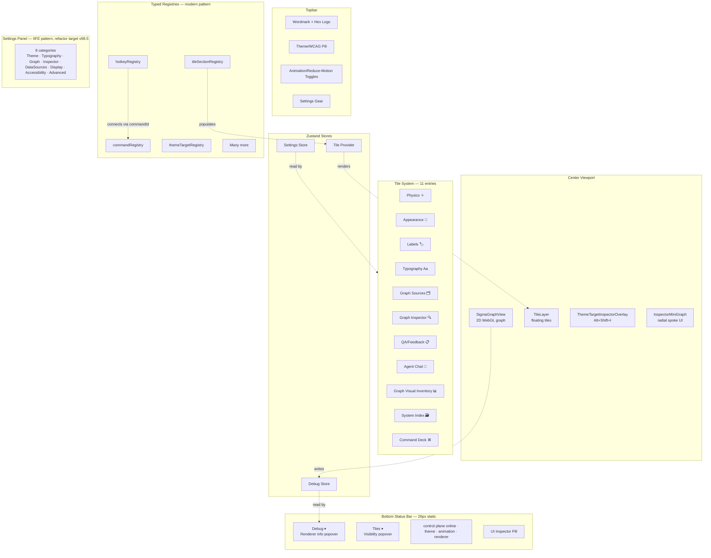
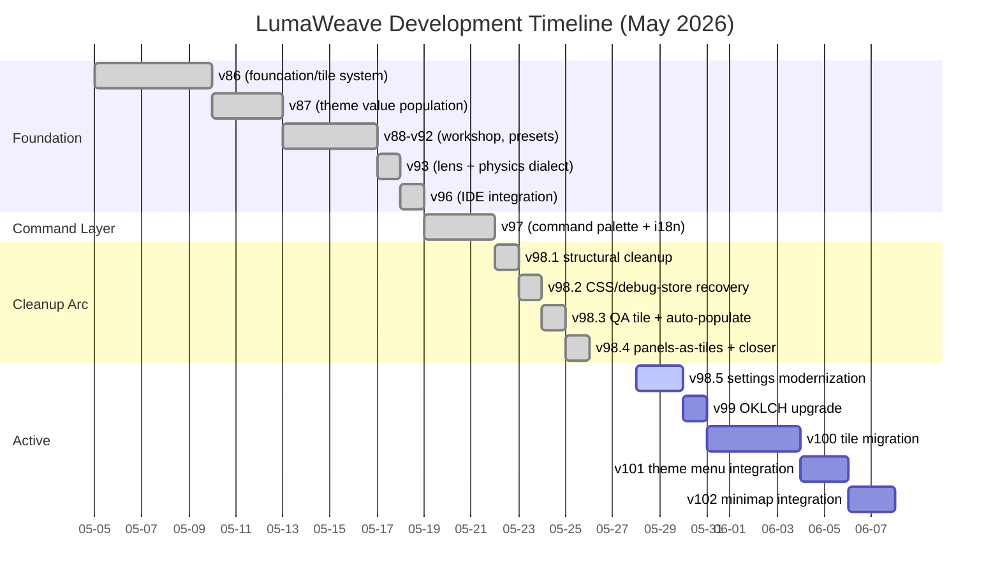
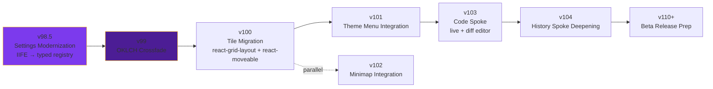
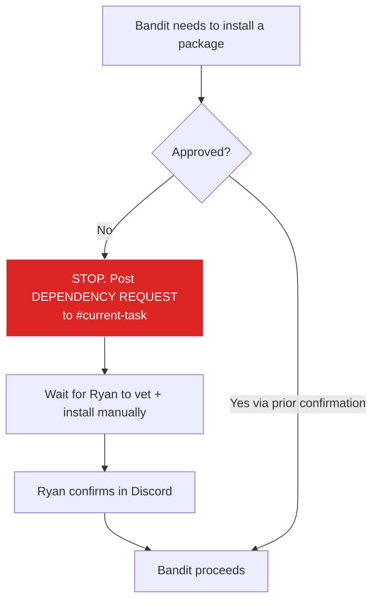
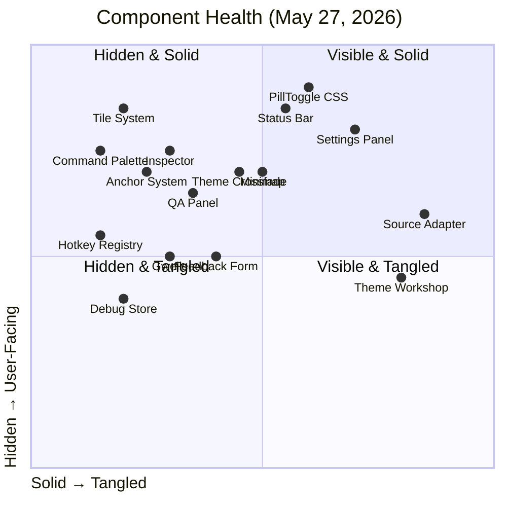
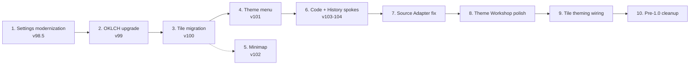
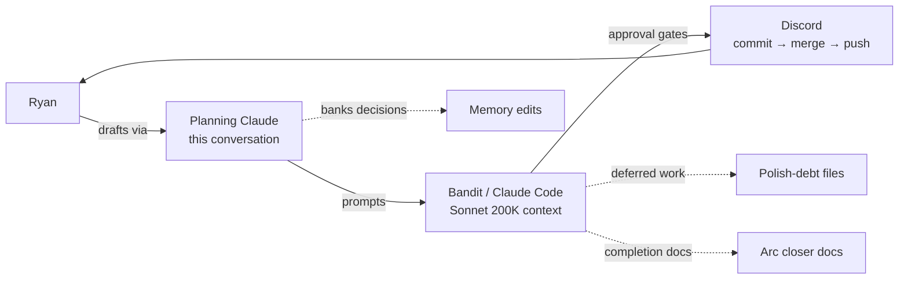

# LumaWeave — Current State

**As of:** 2026-05-27 (evening)
**Project start:** 2026-05-05 (~3 weeks of development)
**Status:** Active development, pre-public-release. Solo development at ~10-30x typical team velocity.

This is the canonical entry-point doc. When context needs reset, this is read first. Everything else is detail.

---

## What LumaWeave Is

LumaWeave is a graph visualization and theming platform within the broader **Lattica** product suite. It treats graphs as instruments — visual, themable, manipulable. Designed for design-tool-quality interaction, not just data display. Built solo by Ryan with parallel Claude orchestration (planning Claude drafts, Bandit/Claude Code executes).

---

## Architecture (high level)

**Key invariants:**
- Status bar dimensions are **static** (26px). Popovers expand upward via portals; never resize the bar.
- All `*TileContent` components are **self-contained** — no required props from AppShell. Theme tokens come via CSS variables.
- The tile system is the **default workspace primitive.** LeftTabPanel was removed. Tiles are how surfaces appear.

---

## Versioning Narrative

---

## Roadmap

**Aspirational/deferred** (no version commitment):
- Lattica Workshop hardening (sandbox, signing, threat model) — pre-1.0 security
- Agent Familiar System — pet project after everything is ~98% polished
- VR compatibility — stretch, may defer indefinitely

**Scrapped from this project:**
- Arena (agent tournament infrastructure) — moved to external project

---

## Critical Process Rules

**Package safeguard:** NO unsupervised installs of any kind. npm, yarn, pnpm, pip, apt, snap, flatpak, brew, cargo, etc. Every install goes through manual vetting. Live supply-chain attacks (self-replicating worms in canonical packages) make this non-negotiable. Documented in `CLAUDE.md` at repo root.

**Arc structure:** Every version follows `vN.0` (design/opener) → `vN.1..vN.x-1` (implementation passes) → `vN.x` (arc closer with summary, polish-debt reconciliation, test cleanup).

**Verification discipline:** Every Bandit pass requires explicit pass/fail per smoke item, screenshots for visual deliverables, dependency-removal verification (grep + visual). "Manual smoke verified" without enumeration is not acceptable.

---

## Current State of Components

---

## Known Paperweights & Tangles

These are items that are present in the codebase but not functioning as intended. They're acceptable in private development; they need resolution before public release.

| Item | Issue | Priority | Notes |
|---|---|---|---|
| **Source Adapter** | Reads incorrect information, has hardcoded values instead of metadata | High | Was deprioritized due to context density during v86-v97 |
| **Theme Workshop** | Functionality incomplete; components present but not wired | Medium | Re-arms via Settings → Advanced are stubs |
| **Tile CSS theming** | All tiles use hardcoded CSS, don't obey theme tokens | Medium | Visible but acceptable in private dev |
| **Topbar PillToggle styling** | Pills render as raw text+glyphs in some states | Low (cosmetic) | CSS landed in v98.2; may have regressed; re-verify |
| **Status bar layout** | Multi-line stack in some screenshots; may be CSS regression | Low (cosmetic) | Re-verify in clean state |
| **Settings IIFE pattern** | `window.LW_*` globals instead of typed registries | High | v98.5 target |
| **Settings store stale keys** | `leftPanelCollapsed`, `*TabSections` from removed LeftTabPanel | Low | Future schema cleanup |
| **AppShell commented blocks** | `{/* v86a: tile system is v86c */}` style cruft | Low | Future cleanup |
| **Various tangled pipelines** | Hard to identify without dedicated investigation | Variable | "Once context is cleaner, easier to surface" |

This list will grow as items are surfaced. Polish-debt files accumulate the formal record.

---

## Six Things Before Ship (Sequenced)

Ryan's count of "half dozen major things." The roadmap above expresses these as version arcs:

Items 7-10 are the paperweight tangles surfacing as their own polish passes. Their exact version numbers depend on what gets surfaced as Ryan navigates clearer post-cleanup context.

---

## Tools & Workflow

**Two-Claude orchestration:** Planning Claude drafts architecture and prompts. Bandit executes. Discord coordinates with explicit approval gates (commit → merge → push), each requiring Ryan's confirmation.

**Hardware:** Local dev on RTX 4070 Super. Ollama + LiteLLM + Open WebUI (Docker) for local agent infrastructure.

**Implementation context:** Bandit runs Sonnet 200K context. Long context lets it hold the project model but doesn't replace explicit verification.

---

## Stop-the-World Items

- **Tonight (2026-05-27):** Local codebase backed up to offline medium. STARTED at ~7:00 PM, ETA ~9:00 PM. Critical given active npm supply-chain attacks.
- **Before any package install:** Manual vetting (publication date, maintainer history, dependency chain). No exceptions.
- **Before any pass commit merge:** Verification discipline observed. Screenshots and pass/fail enumeration required.

---

## Reading Order for Context Reset

When context is fresh (new conversation, after a break, etc.), read in this order:

1. **This doc** — orientation
2. **`docs/v98_4_ARC_CLOSER.md`** (or latest arc closer) — what just landed
3. **Whatever prompt is being drafted/executed** — current focus
4. **Specific files referenced by that prompt** — only as needed

Don't pre-load every doc. The forest is dense. This doc is the trailhead.

---

## Doc Consolidation Plan

The full doc consolidation is queued for **after v100-v101 settle.** At that point:
- Add status headers to every doc (`status: current` / `status: superseded by X` / `status: archive-candidate`)
- Move superseded docs to `docs/archive/`
- Separate generated docs (`provenance-manifest.json`, `self-graph-generated.json`) into their own folder so PK searches stay clean
- Update this doc to reflect post-v100 architecture

Until then: this doc is the entry point. Other docs supplement.
