# LumaWeave — Control Plane & System Index

How users drive LumaWeave: the command system (palette + deck), navigation perspectives, the control-plane render modes, and the System Index — the searchable catalog of the app's own systems. This is the "cockpit" layer: how you find and trigger functionality, and how the app describes itself to itself.

**Supersedes:** `MISSION_CONTROL_OVERVIEW.md`, `COMMAND_DECK_AND_HOTKEY_REGISTRY_CONTRACT.md`, `PERSPECTIVE_SYSTEM_CONTRACT.md`, `SYSTEM_INDEX_REGISTRY_CONTRACT.md`, `SYSTEM_INDEX_PANEL_MOUNT_CONTRACT.md`, `SYSTEM_INDEX_PANEL_ROUTE_DISCOVERY.md`, `HUMAN_MODE_EVIDENCE_MODE_CONTRACT.md`, `GRAPH_CONTROL_PLANE_NAVIGATION_CONTRACT.md`, `CONTRACT_TO_CODE_TRACE_MATRIX.md`

---

## §1 — What it is

The control plane is the set of surfaces that let a user invoke functionality and navigate the app, plus the metadata layer that catalogs what functionality exists. Four pillars:

- **Commands** — every triggerable action, registered once and invoked from the Command Palette (Ctrl+K) or the Command Deck.
- **Perspectives** — named viewpoints onto the graph/app (architecture view, theme-mapping view, etc.).
- **Control-plane modes** — Human / Evidence / Debug, a declared rendering posture for surfaces.
- **System Index** — a searchable, typed catalog of LumaWeave's own systems, contracts, registries, and validators.

Commands are wired and live. Perspectives are partly live. Modes and the System Index are **metadata/scaffold** — typed and queryable, intended to drive future discovery UI, but not yet governing runtime behavior.

**Mental model:** commands are the verbs (do a thing), perspectives are the saved views (look a way), modes are a declared posture (not yet a switch), and the System Index is the app's self-description catalog (what exists, for tooling to read).

---

## §2 — The parts & how they connect

```mermaid
flowchart TD
    subgraph CMD["Commands (live)"]
        CR["command-registry.ts<br/>register/getById/list"]
        CE["command-registry.entries.ts<br/>entries call register() on import,<br/>execute: () => dispatch(event)"]
        CE --> CR
        CR --> PAL["Command Palette (Ctrl+K)"]
        CR --> DECK["Command Deck<br/>(+ shows hotkey registry)"]
    end
    PAL -->|dispatch app event| APP["AppShell / handlers react"]
    DECK -->|dispatch app event| APP
    HK["hotkeys/ registry"] --> DECK

    subgraph META["Discovery metadata (scaffold)"]
        PER["perspectiveRegistry.ts<br/>named viewpoints"]
        MODE["controlPlaneModeRegistry.ts<br/>human/evidence/debug"]
        SI["systemIndexRegistry.ts<br/>catalog of LumaWeave systems"]
    end
    SI --> SIP["System Index panel/tile<br/>(searchable display)"]
    style CMD fill:#1a3025,stroke:#4a8
    style META fill:#2a2440,stroke:#96c
```

**Command system.** `command-registry.ts` is a thin register/get object (a registry+entries variant — see the Registry doc). `command-registry.entries.ts` populates it as an import side effect; each entry has an `id`, `label`, `category`, optional `destructive`/`enabled`, and an `execute()` that **dispatches an app event** (e.g. `dispatch("settings:open")`) rather than calling logic directly — decoupling the command from its handler. The Command Palette (`CommandPalette.tsx` + `useCommandPaletteState.ts`) is the Ctrl+K searchable launcher; the Command Deck (`CommandDeckShell.tsx`) is a panel that lists commands and the active hotkey registry side by side.

**Perspectives.** `perspectiveRegistry.ts` (a contract-object registry) holds named viewpoints with `category` and `status` (active vs future) — e.g. default-architecture, theme-mapping, command-deck, qa-evidence are active; graph-physics, source-adapter are future.

**Control-plane modes.** `controlPlaneModeRegistry.ts` declares three modes (Human, Evidence, Debug) with evidence/debug policies. It explicitly exists to "prepare for future mode-aware rendering without adding a runtime toggle" — declared posture, no live switch yet.

**System Index.** `systemIndexRegistry.ts` is a Tier-1 catalog of LumaWeave's systems (QA/governance, graph boundary, theme, motion safety, source-adapter future, evidence/traceability, dev tooling, etc.), each a richly-typed entry. It feeds a searchable System Index panel and is intended for a future Registry Explorer / self-graph / governance discovery.

**Chrome.** The Topbar and StatusBar (`StatusPill`/`StatusCluster`) are the persistent control surfaces; settings open via a command-dispatched event.

---

## §3 — How to work in it safely

### What's live vs scaffold

- **Live:** the command system (palette, deck, dispatch), the hotkey layer (see the Registry doc — hotkeys live in `control-plane/hotkeys/`), the status/topbar chrome.
- **Partly live:** perspectives (registry + some active entries; the navigation UI consuming them is limited).
- **Scaffold (do not assume runtime effect):** control-plane modes (no toggle — declared posture only) and the System Index (catalog metadata for future discovery UI; it does not govern behavior).

### Invariants

- **Commands dispatch events; they don't call logic inline.** Keep `execute()` a thin dispatch so the command is decoupled from its handler — the handler lives where the behavior lives (AppShell, a store, etc.).
- **Destructive commands are flagged** (`destructive: true`) and the palette confirms before executing — preserve that gate when adding one.
- **The System Index is metadata, not a control path.** Editing an index entry documents a system; it does not change behavior.
- **Modes have no runtime toggle by design** — don't wire a half-toggle; mode-aware rendering is a deliberate future step with its own contract.

### Dependencies & frontend connection

- The Command Palette and Deck read the command registry; the Deck also reads the hotkey registry. Both surface through the Topbar / app shell.
- Validators guard the metadata: `validate-system-index.mjs` and `validate-control-plane-modes.mjs` enforce entry shape in CI.
- Settings, inspector, minimap, reduce-motion, graph-fit, etc. are all reachable as commands — adding a feature usually means adding a command entry that dispatches its event.

### Gotchas

- A command can be *registered and visible* yet point at an event nothing handles — confirm the dispatch target has a listener.
- The System Index categories include future/aspirational buckets (e.g. "Arena / Simulation Future Concepts") — presence in the index is not evidence a system ships.

---

## §4 — How to extend it

**Add a command:** add an entry to `command-registry.entries.ts` — id, label, category, `execute: () => dispatch("your:event")`, plus `destructive`/`enabled` if relevant. Add a listener for the event where the behavior lives. Optionally bind a hotkey in the hotkeys registry.

**Add a perspective:** add to `perspectiveRegistry.ts` with category + status. Mark `future` until the consuming view exists.

**Add a System Index entry:** add a typed entry to `systemIndexRegistry.ts` in the right category; `validate-system-index.mjs` enforces the shape. This documents a system for discovery — it's catalog, not wiring.

**Promote modes to live:** when mode-aware rendering is built, it gets its own contract and a real toggle; until then, treat the mode registry as declarative.

## §5 — How it's designed to grow

- **Event-dispatch decoupling** is the seam that lets commands scale: any surface can dispatch a command's event, and any module can handle it, without the command knowing who. Voice, agent, or remote triggers can invoke commands the same way the palette does.
- **The System Index is the foundation for a Registry Explorer** — a future UI that browses LumaWeave's own systems/contracts/registries as a graph (it overlaps with the self-graph and source-adapter visions). The richly-typed catalog is being built ahead of that UI.
- **Control-plane modes** are the declared groundwork for mode-aware rendering: Human (clean), Evidence (validation-sensitive, traceable), Debug (instrumented). When lit up, surfaces render differently by mode without per-surface conditionals — the policy lives in the mode registry.
- **Perspectives** grow into a saved-view system: named camera/filter/layout combinations a user switches between; the `future` entries (graph-physics, source-adapter) are the next viewpoints.

## §6 — Where it lives in code

Under `src/control-plane/` unless noted.

- **Commands:** `commands/command-registry.ts`, `commands/command-registry.entries.ts`, `commands/command.types.ts`; palette `CommandPalette.tsx` / `CommandPaletteHost.tsx` / `useCommandPaletteState.ts`; deck `CommandDeckShell.tsx` / `CommandDeckPanel.tsx` / `CommandDeckTileContent.tsx`
- **Hotkeys (see Registry doc):** `control-plane/hotkeys/`
- **Modes:** `modes/controlPlaneModeRegistry.ts` + `validate-control-plane-modes.mjs`
- **Perspectives:** `perspectives/perspectiveRegistry.ts` + `tests/e2e/perspective-system.spec.ts`
- **System Index:** `system-index/systemIndexRegistry.ts`, `SystemIndexPanel.tsx`, `SystemIndexTileContent.tsx` + `validate-system-index.mjs`
- **Chrome:** `Topbar.tsx`, `StatusBar.tsx`, `StatusPill.tsx`, `StatusCluster.tsx`
