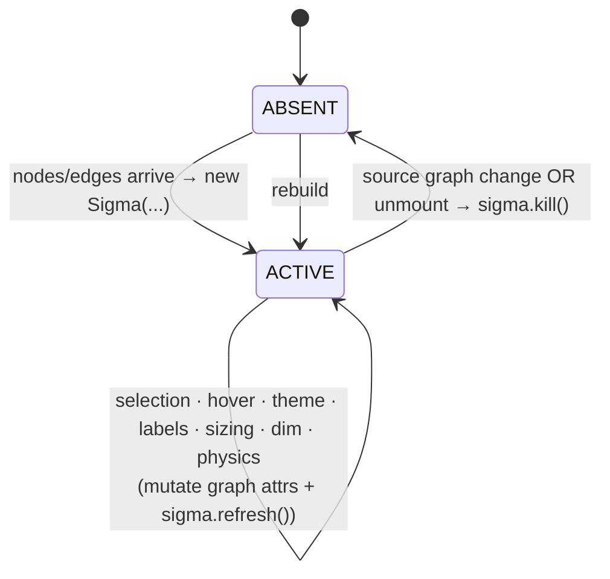

# LumaWeave — Graph, Sigma & Rendering

How a set of nodes and edges becomes the living, themed, physics-driven graph on screen: the build pipeline, the Sigma instance lifecycle, the per-node geometry programs, and the policy layers that style, label, and dim the graph.

**Supersedes:** `SIGMA_LIFECYCLE_CONTRACT.md`, `RENDERING_LAYER_ARCHITECTURE.md`, `GRAPH_VISUAL_POLICY.md`, `GRAPH_COLOR_OWNERSHIP.md`, `GRAPH_RUNTIME_BOUNDARY_CONTRACT.md`, `FIRST_GRAPH_RUNTIME_MUTATION_CONTRACT.md` (rendering portions), `sigma-label-position-offset.md`

---

## §1 — What it is

The rendering system draws the graph using **Sigma 3** (WebGL) over a **Graphology** graph model. Source nodes/edges are normalized, built into a Graphology graph, styled by policy, and handed to a single Sigma instance that renders to a canvas. Custom WebGL programs give each node a distinct material (glass sphere, sun, crystal, orb, pip) and edges a plasma shader. A physics layer (Gwells — its own doc) positions the nodes; this doc covers everything from "graph data exists" to "pixels on screen."

The defining design principle: **one Sigma instance, reconciled in place.** Sigma is expensive to construct, so it is created once per graph dataset and then *mutated* for every other change — selection, hover, theme, labels, sizing, physics. It is recreated only when the underlying node/edge data changes.

**Mental model:** Graphology is the data + per-element style attributes; Sigma is the renderer reading those attributes; policy functions write the attributes; React effects own the Sigma lifecycle and translate UI state into in-place mutations.

---

## §2 — The parts & how they connect

### Build pipeline (data → screen)

```mermaid
flowchart LR
    Src["source nodes/edges<br/>(adapter or fixture)"] --> Norm["normalizeGraphifyGraph.ts<br/>canonical shape"]
    Norm --> Build["buildGraphologyGraph.ts<br/>Graphology graph + diagnostics"]
    Build --> Pol["policy pass (pre-render)<br/>label · style · dim"]
    Pol --> Sig["new Sigma(graph, container)<br/>+ node program classes"]
    Sig --> Phys["applyDialect(graph) — Gwells physics<br/>positions nodes"]
    Sig --> Canvas["WebGL canvas"]
    style Build fill:#1a2535,stroke:#69c
    style Sig fill:#2a2a3a,stroke:#88a
    style Canvas fill:#1a3025,stroke:#4a8
```

`buildGraphologyGraph` constructs the Graphology graph and returns structural diagnostics (component count, isolated nodes, largest component, coordinate bounds). Before Sigma renders, three policy passes write per-element attributes onto the graph so the first paint is already correct (no one-frame flash of unstyled/all-labels state).

### The render layers

`SigmaGraphView.tsx` (the orchestrator) composes:
- **The Graphology graph** — nodes/edges with style attributes (`color`, `size`, `labelColor`, `type` = which node program, hidden/dim flags).
- **Node programs** — per-node WebGL materials, chosen by each node's `type` attribute (§ below).
- **The edge program** — `PlasmaEdgeProgram`, a custom animated plasma shader.
- **Policy functions** — pure functions that compute and write attributes: `graphStylePolicy` (colors/sizes/selection), `graphLabelPolicy` + `labelPolicy` (label visibility), `dimmingPolicy` (fade non-neighborhood), `selectionNeighborhood` (BFS neighborhood resolution).
- **Camera controller** — `cameraController.ts`, attached once, preserves camera state across mutations.

### Node geometry programs

`nodeProgramRegistry.ts` is a Tier-1 const-array of five **active** programs, each a WebGL program class with a fragment shader:

| Program | Material | Intended role |
|---|---|---|
| `glass-sphere` | specular sphere, hum pulse, flow rotation | **default** |
| `sun` | multi-ring corona, pulsing outer ring | hub / identity nodes |
| `crystal` | faceted, refractive, sharp speculars | decision nodes, formal types |
| `orb` | soft luminous breathing sphere, halo bloom | ambient / background nodes |
| `pip` | flat minimal dot | leaf / low-importance / dense clusters |

A node's program is its `type` attribute. **All programs are pre-registered** at Sigma construction (`buildNodeProgramClasses`), which lets a node's geometry change live: `setNodeAttribute(node, "type", newId)` triggers Sigma's re-index and the new program renders immediately — no Sigma reconstruction. `resolveNodeProgramId` falls back to `glass-sphere` for unknown ids.

---

## §3 — How to work in it safely

### The core invariant: reconcile, don't recreate

Sigma is constructed in one effect keyed on `[nodes, edges]`, and that effect's cleanup is the only `sigma.kill()`. **Every other change is an ACTIVE→ACTIVE mutation** handled by a separate effect that writes graph attributes (or Sigma settings) and calls `sigma.refresh()` — it must never construct a new Sigma. This is the single most important rule in the rendering system; violating it was the original performance bug the lifecycle contract was written to kill (Sigma recreated on every slider tick).

What this means in practice — each of these is a dedicated effect mutating the existing instance:
- selection / neighborhood, hover, label policy, node/edge sizing, dim mode, theme, physics dialect, pins, override changes.

### The animation-uniforms rule (v86b)

Animated node materials (hum, flow, glow) are driven by a `requestAnimationFrame` loop reading a **uniforms ref**. That loop **must never call `sigma.setSetting()` or trigger a React render** — it runs at 60fps and would thrash the tree. Reduce-motion freezes the uniform updates; values still resolve, motion stops. If you add an animated material, drive it through the uniforms ref, not through React state.

### Dependencies & order

- Policy passes run **before** the first Sigma render so the initial paint is correct. Preserve that ordering when adding a policy.
- Camera state must persist across all ACTIVE→ACTIVE transitions — don't reset the camera on a mutation (only on initial load / explicit fit).
- Node programs must all be registered at construction; a program added to the registry is available for live type-switching only because of this.

### Frontend connection

- `SigmaGraphView` receives graph data + a wide set of settings/handlers as props from `AppShell`; selection and path-target flow back up via `onSelectNode`/`onSelectEdge`/`onSetPathTarget` callbacks (held in refs so the Sigma event handlers always see current values without re-subscribing).
- Theme reaches the graph two ways: `resolveGraphVisualTokens` (theme graph tokens + settings overrides) feeds style policy, and override changes arrive via the `lw:override-change` event (handled by a no-dep effect that reads `sigmaRef.current` at call time).

### Gotchas

- **Edge weight is ignored.** `buildGraphologyGraph` hardcodes `weight: 1` on every edge; it does **not** read `edge.weight` from the source, despite the schema intending weight-driven FA2 attraction. Weight-based physics will not work until this is wired. (Logged as polish debt.)
- **`allowInvalidContainer: true`** is set — Sigma tolerates a zero-size container at construction (it can mount before layout settles); the ResizeObserver corrects sizing after.
- Event handlers are bound once on the live instance and read mutable refs — don't try to "fix" them into the dependency array; that would re-subscribe on every render.

---

## §4 — How to extend it

**Add a node geometry program:** write the program class + fragment shader, add an entry to `NODE_PROGRAM_REGISTRY` (id, label, description, status, class). It's immediately available for live type-switching because all programs register at construction. Set a node's `type` to the new id to use it.

**Add a styling/label/dim behavior:** write a pure policy function that takes the graph + interaction state and writes attributes; call it in the appropriate mutation effect, then `sigma.refresh()`. Keep it pure (graph in, attributes out) so it can run pre-render and on mutation identically.

**Add a setting that affects the graph:** add a dedicated effect that mutates the existing Sigma instance — never extend the `[nodes, edges]` recreate effect, or you reintroduce recreate-on-change.

---

## §5 — How it's designed to grow

- **Renderer interface seam.** `graphRendererInterface.ts` is a thin abstraction over the renderer. Sigma 2D is the shipped implementation; the seam is what a future renderer (the eventual three.js / react-three-fiber 3D path) plugs into without rewriting the policy layer. Policies write semantic attributes, not Sigma-specific calls, so they survive a renderer swap.
- **Node-program taxonomy scales by registration.** Adding materials is O(1) and composes — the registry drives the geometry spoke and live switching. A node-type→program mapping system can grow on top without touching the programs.
- **Physics is pluggable** (Gwells dialects, separate doc) — the rendering layer calls `applyDialect` against the live graph; new dialects don't touch rendering.
- **Effect scaling.** Each new interactive behavior is a new isolated effect mutating the instance. The cost of growth is effect count, not render cost — the single-instance invariant keeps per-change work to an attribute write + refresh.

---

## §6 — Where it lives in code

Under `src/graph/` unless noted.

- **Orchestrator:** `graph/.../SigmaGraphView.tsx` (instance lifecycle, all mutation effects, event binding)
- **Build:** `normalizeGraphifyGraph.ts`, `buildGraphologyGraph.ts`
- **Node programs:** `graph/nodePrograms/` — `nodeProgramRegistry.ts`, `GlassSphereProgram.ts`, `SunProgram.ts`, `CrystalProgram.ts`, `OrbProgram.ts`, `PipProgram.ts`, + `*_frag.glsl`
- **Edge program:** `graph/edgePrograms/PlasmaEdgeProgram.ts` + `plasma_frag.glsl` / `plasma_vert.glsl`
- **Policy layer:** `graph/visual/` — `graphStylePolicy.ts`, `graphLabelPolicy.ts`, `applyGraphLabelPolicyToGraphology.ts`, `labelPolicy.ts`, `dimmingPolicy.ts`, `selectionNeighborhood.ts`, `graphVisualTokens.ts`, `edgeStyleRegistry.ts`
- **Camera & overlay:** `graph/overlay/cameraController.ts`
- **Renderer seam:** `graphRendererInterface.ts`
- **Physics entry (separate doc):** `physics/gwells` (`applyDialect`, `GWController`), `gwellsProbe.ts`
- **Theme feed (separate doc):** `themes/themeTokens.ts` `resolveGraphVisualTokens`
