# LumaWeave — Source Adapter

How external data becomes a LumaWeave graph. A **source adapter** translates some source (a codebase, a docs vault, a website, an API spec) into the normalized node/edge shape the renderer consumes. Today one adapter is wired end to end (the self-graph fixture); the rest are a catalogued, validated-by-contract roadmap. This doc covers both, clearly separated.

**Supersedes:** `SOURCE_ADAPTER_README.md`, `SOURCE_ADAPTER_CATALOG.md`, `SOURCE_ADAPTER_OS_OVERVIEW.md`, `SOURCE_ADAPTER_OS_CONTRACT.md`, `SOURCE_ADAPTER_ROADMAP.md`, `NORMALIZED_SOURCE_GRAPH_SCHEMA.md`, `TRANSLATION_SET_MODEL.md`, `INGESTION_SAFETY_AND_QA.md`, `WEBSITE_URL_ADAPTER_V0.md`, `SELF_GRAPH_SCHEMA.md`

---

## §1 — What it is

A source adapter takes raw source data and produces normalized nodes and edges with a known shape, which the graph/Sigma layer then renders. The intended end state is an "adapter OS": many adapters (git, markdown vault, website, OpenAPI, database, etc.), each declaring its input patterns, the translation it performs, its safety limits, and the QA report it emits — all governed by a contract and an acceptance lifecycle.

**What actually ships today is one adapter:** the **self-graph**, which renders LumaWeave's own docs/code as a graph from a bundled fixture. Everything else in the registry is a *catalog entry* — a typed declaration of a planned adapter, not a working implementation.

**Mental model:** the registry is a menu of adapters and their declared contracts; the normalizer is the common output shape; an adapter's job is to get from "some source" to "normalized nodes/edges." Right now exactly one menu item is cooked.

---

## §2 — The parts & how they connect

```mermaid
flowchart TD
    subgraph SHIPPED["shipped path (self-graph)"]
        FX["self-graph fixture<br/>(LumaSourceGraph, v0/v1)"] --> AD["adaptSelfGraphToSigma()<br/>self-graph-adapter.ts"]
        AD --> DR["LumaWeaveNodeDraft / EdgeDraft"]
        DR --> RENDER["→ buildGraphologyGraph → Sigma"]
    end
    subgraph REG["catalog + governance"]
        SR["sourceAdapterRegistry.ts<br/>9 adapter entries, typed contracts"]
        VAL["validate-source-adapters.mjs"]
        SR --> VAL
    end
    subgraph BROKEN["live-fetch path (NOT working — see §3)"]
        HOOK["useGraphSourceSummary()"] --> LOAD["loadGraphifySource()<br/>fetch /examples/ai-lab/graphify-out/graph.json"]
        LOAD -.HTML 404.-> ERRSTATE["panel error state"]
    end
    style SHIPPED fill:#1a3025,stroke:#4a8
    style BROKEN fill:#3a1a1a,stroke:#a44
    style REG fill:#2a2440,stroke:#96c
```

**The registry** (`sourceAdapterRegistry.ts`) is a Tier-1 const-array of adapter entries. Each entry declares: `adapterId`, `adapterType`, `adapterVersion`, input patterns (url/path/manifest/schema), a translation set, safety limits, a QA report format, and a `status`. Helpers query by id/type/status/contract-version. It's a typed catalog — declaration, not execution.

**The normalized shape** is `LumaWeaveNodeDraft` / `LumaWeaveEdgeDraft` (in `graph/schema/graph.types`). Every adapter, shipped or future, must emit this. The self-graph adapter (`adaptSelfGraphToSigma`) maps the fixture's `LumaSourceGraph` (supporting both `v0` and `v1` schemas) into it: cluster→color, type→size, edge-type→color, weight→confidence band.

**The summary hook** (`useGraphSourceSummary`) is what `AppShell` calls to load a live source; it delegates to `loadGraphifySource`. (This is the broken path — §3.)

---

## §3 — How to work in it safely

### The shipped reality vs. the catalog

- **One adapter is `registered` and working: `self-graph`.** The other eight entries (git-codebase, website-url, markdown-vault, openapi-spec, database-schema, package-dependency, cloud-infrastructure, issue-tracker) are `candidate` — catalog declarations with no implementation. Do not assume a `candidate` adapter does anything; it's a contract waiting for code.
- **The graph you see by default comes from the self-graph fixture**, adapted by `adaptSelfGraphToSigma`, not from a live fetch.

### Known bug — the JSON-404 paperweight

`loadGraphifySource` fetches `/examples/ai-lab/graphify-out/graph.json` — a hardcoded path pointing at an **external project's** output (`/home/boop/Projects/ai-lab/graphify-out`) that the app does not serve. The fetch returns the SPA's HTML 404 page; `.json()` then throws, and the Graph Sources panel shows an error state. This is the visible JSON-404 paperweight. The self-graph still renders (different path, from the fixture), so the app works — but the live-source panel is broken until the loader points at a real served artifact (or is replaced by a proper adapter-driven load). Must be fixed before public launch; logged as a paperweight.

### Invariants

- **Every adapter emits the normalized draft shape.** Don't let an adapter leak its source-specific shape downstream; normalize at the adapter boundary.
- **Adapters declare safety limits and a QA report** in their registry entry — the governance model expects ingestion to be bounded and auditable, not unbounded.
- **The self-graph adapter handles both schema versions** (`v0` and `lumaweave-self-graph/v1`) — preserve that dual support, or migrate the fixture, but don't half-break one path.

### Frontend connection

- `AppShell` chooses between the fixture path and the live-summary path; the Graph Sources panel/tile (`SourceAdapterPanel.tsx`, `GraphSourcesTileContent.tsx`) surface source state.
- Normalized drafts flow into `buildGraphologyGraph` (see the Graph/Sigma/Rendering doc) — the adapter layer's output is that function's input.

---

## §4 — How to extend it

**Add an adapter (catalog entry):** add a typed entry to `sourceAdapterRegistry.ts` — id, type, version, input patterns, translation set, safety limits, QA report format, `status: "candidate"`. `validate-source-adapters.mjs` enforces the entry shape. This declares the adapter; it does not implement it.

**Implement an adapter:** write the translation (raw source → `LumaWeaveNodeDraft`/`EdgeDraft`), following the self-graph adapter as the reference implementation. Walk the status lifecycle as the implementation matures: `candidate → registered → validated → accepted → active`. Each step is a gate, not an informal label — promote only when the prior stage's evidence exists (validator passing, QA report emitting, etc.).

**Fix the live load path:** point `loadGraphifySource` at an artifact the app actually serves, or replace it with a registry-driven adapter load. Until then, treat the live-source panel as a known-broken surface.

## §5 — How it's designed to grow (the adapter OS vision)

This is where most of the design intent lives — the shipped slice is deliberately small.

- **Many sources, one shape.** The ambition is a library of adapters (codebase, markdown vault, website crawl, OpenAPI, DB schema, package deps, cloud infra, issue tracker) that all normalize to the same node/edge draft, so any source becomes a LumaWeave graph. The registry already enumerates these as candidates with their declared contracts.
- **Translation sets** describe how a source's native concepts map to nodes, edges, and clusters — the per-adapter heart, declared in the registry entry and (eventually) implemented per adapter.
- **Ingestion safety + QA as first-class.** Every adapter declares safety limits (size/count bounds) and a QA report format, so ingestion is bounded and auditable. Confidence typing (`observed` / `inferred` / `ai-inferred`) lets the graph distinguish hard structure from inferred relationships.
- **The acceptance lifecycle** (`candidate→registered→validated→accepted→active`) is the growth path each adapter walks — the same contract→registry→validator→evidence→promotion ladder used elsewhere in LumaWeave, applied to data sources.
- **Schema versioning** is already real: the self-graph fixture supports `v0` and `v1`, with `v1` carrying richer typing (edge weight, provenance, bidirectional, tags). New source schemas extend this rather than replacing it.

The git-codebase adapter is the most likely next implementation (it's the dogfooding use case — visualize the codebase you're working in), followed by markdown-vault (the Obsidian-style audience).

## §6 — Where it lives in code

Under `src/source-adapter/` and `src/graph/` unless noted.

- **Registry + governance:** `sourceAdapterRegistry.ts` (the 9-entry catalog + query helpers), `validate-source-adapters.mjs`
- **Shipped adapter:** `self-graph-adapter.ts` (`adaptSelfGraphToSigma`, v0/v1), fixture generated by `generate-self-graph.mjs` → `self-graph-generated.json` (+ `self-graph-manifest.json`)
- **Live load path (broken):** `loadGraphifySource.ts`, `useGraphSourceSummary.ts`
- **Normalizer + shape:** `normalizeGraphifyGraph.ts`, `graph/schema/graph.types.ts` (`LumaWeaveNodeDraft`/`EdgeDraft`, `GraphSourceSummary`)
- **Source types:** `source-adapter/types.ts` (`LumaSourceGraph`, v0/v1 node/edge types)
- **UI:** `SourceAdapterPanel.tsx`, `SourceAdapterTileContent.tsx`, `GraphSourcesTileContent.tsx`
