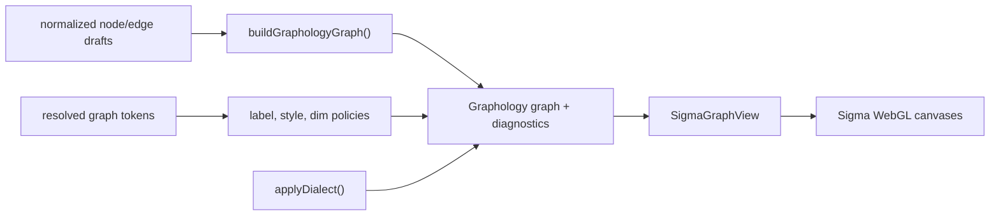

# LumaWeave — Graph, Sigma & Rendering

LumaWeave renders a Graphology model through Sigma 3/WebGL. Source adapters produce normalized drafts; graph construction and visual policy convert them into renderer attributes; GWells mutates positions; Sigma draws the result.

## Data-to-screen pipeline

`buildGraphologyGraph()` creates the live graph, applies initial coordinates and structural diagnostics, and writes source attributes needed by later policy. Policy passes run before the first renderer paint where possible to avoid unstyled flashes.

## Sigma lifecycle

The important boundary is one Sigma instance per `nodes`/`edges` dataset identity.

The construction effect:

1. Builds Graphology.
2. Applies initial label/style policy.
3. Constructs Sigma with all node and edge programs.
4. Attaches camera and event handlers.
5. Starts GWells after Sigma's first render.
6. Cleans up controller, observers, handlers, and Sigma on dataset replacement/unmount.

Other behavior uses dedicated effects that mutate the existing graph/settings and call `sigma.refresh()`:

- Selection and neighborhood dimming.
- Hover and label policy.
- Node/edge sizing.
- Theme and override changes.
- Node-program selection.
- Physics dialect and tuning changes.
- Pin state.

Do not add unrelated settings to the construction effect. That recreates GPU/render state and resets interaction state.

## Custom programs

`nodeProgramRegistry.ts` registers five active programs:

| ID | Character |
|---|---|
| `glass-sphere` | Default specular sphere. |
| `sun` | Hub/identity treatment with corona rings. |
| `crystal` | Faceted treatment for formal or decision-like nodes. |
| `orb` | Soft luminous treatment. |
| `pip` | Dense/minimal leaf treatment. |

All programs are supplied at Sigma construction. Changing a node's `type` attribute followed by a full re-index switches its program without constructing a new Sigma instance.

`PlasmaEdgeProgram` is registered as the default custom edge program.

## Animation and motion safety

Animated shader values are held in a mutable uniforms ref. The animation loop updates uniforms rather than React state or Sigma settings each frame. Reduce Motion freezes time-dependent updates while leaving resolved visual values intact.

Decorative DOM/canvas overlays—solar backdrop, glitter, click halo, bookmarks, and minimap—are layered separately from Sigma and must preserve pointer and stacking boundaries.

## Interaction and camera

Sigma event handlers feed React selection/path state through callback refs so handlers do not need to re-register on every render. Dragging writes node positions and fixed state directly to Graphology; GWells pin state is reconciled separately.

The camera controller owns animated fit/pan behavior and respects Reduce Motion. Resize updates canvas dimensions without resetting the user's camera after initial load.

## Theme boundary

Theme runtime tokens are resolved into graph visual tokens before policy writes attributes. Scoped override changes notify the graph through the `lw:override-change` event. Graph programs consume resolved attributes/uniforms; they do not import theme authoring modules.

## Known limitations

- Graph construction currently writes `weight: 1` for every edge, so source edge weights do not affect rendering/physics.
- Some test-only globals expose Sigma, camera, uniforms, and GWells probes in development/Playwright contexts.
- One overlay timing test remains skipped; see [Known Issues](../KNOWN_ISSUES.md).
- The graph renderer interface is only a type-level seam. `SigmaGraphView` does not implement `GraphRenderer`, and no renderer is selected through that interface today.

## Future renderer boundary

`src/graph/rendering/graphRendererInterface.ts` describes a small mount/camera/refresh contract, but integrating a second renderer requires real adapter work:

- Express graph visual policy without relying on Sigma-specific attributes.
- Map selection, camera, labels, materials, and theme tokens.
- Define lifecycle ownership and renderer switching.
- Add equivalent accessibility and motion behavior.
- Decide how 2D and 3D override values translate.

Three.js, React Three Fiber, and Drei are installed but unused by runtime source. Their presence is not a 3D implementation.

## Extending rendering safely

- Add new node/edge programs through their registries and construction maps.
- Add visual behavior as a pure policy plus a focused mutation effect.
- Keep animation out of React render state.
- Preserve camera and selection during non-dataset changes.
- Add tests for program registration, instance identity, Reduce Motion, and first-value application.

## Code map

- Orchestrator: `src/graph/renderers/sigma2d/SigmaGraphView.tsx`
- Graph build: `src/graph/renderers/sigma2d/buildGraphologyGraph.ts`
- Programs: `src/graph/nodePrograms/`, `src/graph/edgePrograms/`
- Policies: `src/graph/visual/`
- Overlays/camera: `src/graph/overlay/`
- Renderer type seam: `src/graph/rendering/graphRendererInterface.ts`
- Physics: `src/physics/gwells/`
