# LumaWeave — Gwells Physics

How LumaWeave positions graph nodes: a custom, registry-driven force-simulation engine. "Gwells" = gravity wells. It is **not** Graphology's ForceAtlas2 — it's a hand-rolled engine where node behavior is composed from typed registry entries (well types, interactions, seed functions, dialects) rather than global tuning knobs.

**Supersedes:** `GWELLS_OVERVIEW.md`, `GWELLS_ARCHITECTURE.md`, `GWELLS_PIPELINES.md`, `GWELLS_LAYOUT_RULES.md`, `GWELLS_REGISTRY_PATTERNS.md`, `GWELLS_DIALECT_RADIAL_BACKBONE.md`, `GWELLS_DIALECT_PARALLEL_SPINES.md`, `GWELLS_PROBES_AND_DIAGNOSTICS.md`, `GWELLS_CURRENT_STATE.md`, `GWELLS_README.md`, `GRAVITY_WELL_SYSTEM_CONTRACT.md`, `PHYSICS_DIALECT_SYSTEM.md`; `GWELLS_FUTURE_VISION.md` + `GWELLS_DESIGN_CONVERSATIONS.md` fold into §5

---

## §1 — What it is

Gwells decides where every node sits. Each node is assigned a **well type** (a force profile — anchor, orbiter, spine member, fan endpoint). **Interactions** describe how well types push and pull each other (attraction, repulsion, spring, alignment), optionally filtered by the graph's structural edges. A **seed function** computes initial positions; a **dialect** bundles a seed function + a well-assignment rule + a set of active interactions into one named layout personality. `applyDialect(graph, dialectId, options?)` wires it all up and returns a controller that runs the simulation through the configured scheduler against the live Graphology graph. The browser default uses `requestAnimationFrame`; headless consumers can inject a scheduler or call `step()` manually. The controller exposes `stop()`, `pause()`, `resume()`, `step()`, `getRuntimeState()`, `getDialectId()`, `getResolvedConfig()`, `applyConfigOverride()`, and `applyPins()`, and optional `scheduler`, `onDebug`, and `onError` hooks let callers control lifecycle timing and observe cache/runtime events without wiring app concerns into the physics core.

The organizing principle: **directory containment drives layout.** The `contains` edges (parent→child) are the structural spine; interactions use them as filters so a file orbits *its own* directory, not every directory. Metadata edges (tags, links) are weak overlay, not layout drivers.

**Mental model:** well types are roles, interactions are the rules between roles, the seed function is the opening arrangement, a dialect is a complete choreography, and the engine is the loop that runs it.

---

## §2 — The parts & how they connect

Five registries feed one engine entry point:

```mermaid
flowchart TD
    WT["wellTypes.ts<br/>force profiles<br/>(anchor/orbit/spine/fan)"] --> D
    IX["interactions.ts<br/>role→role forces<br/>+ edge filters"] --> D
    SF["seedFunctions.ts<br/>initial positions<br/>(→ seeders/*.ts)"] --> D
    D["dialects.ts<br/>seedFn + wellAssignment<br/>+ activeInteractions"]
    D --> AD["applyDialect(graph, dialectId, options?)"]
    AD --> CTRL["GWController<br/>stop/pause/resume<br/>applyConfigOverride/applyPins"]
    AD --> LOOP["scheduler tick → stepPhysics"]
    style D fill:#2a2440,stroke:#96c
    style AD fill:#2a2a3a,stroke:#88a
    style LOOP fill:#1a3025,stroke:#4a8
```

**`applyDialect` setup (one-time):** resolve dialect (fall back to default on unknown) → merge engine + dialect config → run the seed function for initial positions → cache each node's well-type assignment → build a `parentOfNode` map from `contains` edges → build the resolved interaction table (applying config overrides). Then it schedules the automatic loop and returns the controller.

**The per-frame loop (`stepPhysics`):** for each non-pinned, non-dragged node, accumulate force from every active interaction whose `source` matches the node's well type, against every node matching the interaction's `target`, subject to the edge filter and range cutoff. Integrate, write new `x`/`y` back to the graph. `GWController.step()` returns a `GWStepResult`, and when benchmark timing is enabled that result includes coarse `GWStepTimings` buckets for reset, seed lookup, force interactions, auxiliary forces, and integration. `GWRuntimeState` tracks the controller lifecycle (`running`, `paused`, `stopped`, `error`), and `GWDebugEvent` is the typed event stream that `onDebug` receives for cache rebuilds, pause/resume, stop, seed reruns, warnings, and runtime errors.

The current UI-safe control plane feeds into this API through `SigmaGraphView`, which passes active seed overrides and pins into `applyConfigOverride()` / `applyPins()`, while the app shell and settings registry own dialect selection and per-dialect tuning state.

```mermaid
flowchart TD
    F["for each non-pinned node"] --> I["for each interaction where source == node's wellType"]
    I --> T["for each other node where wellType == interaction.target"]
    T --> EF{"edge filter?<br/>contains-parent / shared-parent /<br/>no-contains-parent"}
    EF -->|fails| T
    EF -->|passes| R{"within range?"}
    R -->|no| T
    R -->|yes| K["force by kind:<br/>attraction · repulsion (1/d²) ·<br/>spring (Hooke to ideal dist) · alignment"]
    K --> ACC["accumulate fx, fy"]
    ACC --> INT["integrate → write x,y to graph"]
    style EF fill:#2a2520,stroke:#a84
    style K fill:#1a2535,stroke:#69c
```

**Current registry contents:** 4 well types (`spine-linear`, `directory-anchor`, `file-orbit`, `endpoint-fan`), an edge-aware interaction set among them, 2 active dialects (`radial-backbone`, `parallel-spines`) that share the interaction set but differ in seed function and arrangement. Force kinds: `attraction`, `repulsion` (inverse-square), `spring` (Hooke toward an ideal distance, with per-pair seeded distances), `linear-alignment`/`perpendicular` (structural).

---

## §3 — How to work in it safely

### Invariants

- **The engine owns positions; it mutates `x`/`y` on the Graphology graph each frame.** Nothing else should write node positions while a dialect is running, except via the controller (`applyPins`).
- **Pins and drags are honored.** A node with `fixed === true` (Sigma drag convention) or in the pinned set is skipped by the force loop. Pin state is stored *on the graph* (`__gwellsPinnedSet`), so it survives controller replacement on dialect switch — that's what lets switching dialects correctly release the previous dialect's pins.
- **Seed functions are pure** — same input, same output, run once before the loop (and re-run on a seed-param override). Keep them pure; the engine relies on re-running them to reposition.
- **Errors are contained, never fatal.** Seed failures, a throwing `wellAssignment.assign`, a bad step, and decoration-callback failures are all caught and routed to `options.onError` (or warned) — a single bad node never kills the loop.

### Dependencies & order

- Gwells runs *after* Sigma construction — `SigmaGraphView` calls `applyDialect` against the live graph. Dialect change is an ACTIVE→ACTIVE mutation (stop old controller, `applyDialect` new one); it never recreates Sigma (see the Graph/Sigma/Rendering doc).
- Interactions depend on well assignment (a node must have a well type before interactions apply) and on the `contains`-edge `parentOfNode` map for edge-filtered forces.

### Frontend connection

- `AppShell` passes `dialectId`, per-dialect `seedParamOverrides`, and `pins` into `SigmaGraphView`, which holds the `GWController` in a ref. Live tuning sliders call `controller.applyConfigOverride(...)` (in-place merge, no restart); pin changes call `controller.applyPins(...)`.
- The decoration callback hook lets per-frame visual effects (audio reactivity, jitter) run inside the loop without the loop knowing about them.

### Gotchas

- **This is not FA2.** Don't reach for Graphology/FA2 tuning; forces come from the interaction registry. Edge *weight* is not consumed here (and `buildGraphologyGraph` hardcodes weight — see the Graph doc's polish note).
- **Edge filters are structural, via `contains` only.** `contains-parent`, `shared-parent`, `no-contains-parent` all read the `contains` edge map. Other edge types don't participate in filtering.
- Config override rebuilds the resolved interaction array in place; seed-param override re-runs the seed function (visible reposition). Know which override path you're triggering.

---

## §4 — How to extend it

**Add a well type:** add an entry to `wellTypes.ts` (id + force defaults: attraction strength, spring stiffness, ideal distance, etc.). Reference it from interactions and a dialect's `wellAssignment`.

**Add an interaction:** add to `interactions.ts` (source well, target well, kind, strength, optional range/idealDistance, optional `requireEdge` filter). Add its id to a dialect's `activeInteractions` to make it live.

**Add a dialect:** add to `dialects.ts` — a `seedFunctionId`, a `wellAssignment.assign(nodeId, attrs)` mapping nodes to well types, and the `activeInteractions` list. Register its seed function in `seedFunctions.ts` (implementation in `seeders/<name>.ts`).

**Add a force kind:** extend the `kind` switch in `stepPhysics`. Keep it a pure force contribution (in → fx/fy out).

All four are registry additions — the engine reads the registries; you don't touch the loop except to add a force kind.

## §5 — How it's designed to grow

- **Composition scales by registration.** N well types × their interactions compose additively in the force loop; a new dialect is a new bundle, not new engine code. The cost of growth is registry entries and per-frame pair cost, not engine complexity.
- **3D is seeded already.** Seed functions store a `z` attribute (parallel-spines arranges spines in a ring around a central axis in 3D) for forward-compatibility with a future 3D camera — the data is there ahead of the renderer. This is the seam the eventual three.js/react-three-fiber path consumes.
- **Live tuning + pinning** are first-class via the controller (`applyConfigOverride`, `applyPins`), enabling interactive layout authoring without restarts — the basis for a future dialect-tuning UI.
- **Decoration hook** is the seam for audio-reactive and other per-frame visual modulation (deferred features) without entangling them with physics.
- **Performance note:** `stepPhysics` is benchmarked via `npm run physics:gwells:bench`, which records `benchmarks/gwells-latest.json` and coarse `GWStepTimings` buckets. `npm run physics:gwells:bench -- --update-baseline` intentionally refreshes the committed `benchmarks/gwells-baseline.json`; normal runs leave the baseline unchanged. The current fixture matrix covers filesystem-small/medium/large, current-like-400, hierarchy-1000, hierarchy-2000, stress-5000, wide-roots-30, mixed-graph, generic-no-spine, and disconnected-orphan-heavy.

## §6 — Where it lives in code

Under `src/physics/gwells/`.

- **Public API:** `index.ts` (re-exports registries, types, `applyDialect`)
- **Engine:** `engine.ts` (`applyDialect`, `stepPhysics`, scheduler-backed automatic ticking, `GWController` with `applyConfigOverride`/`applyPins`)
- **Registries:** `wellTypes.ts`, `interactions.ts`, `seedFunctions.ts`, `dialects.ts`
- **Seeders:** `seeders/radialBackbone.ts`, `seeders/parallelSpines.ts`; shared math in `seederHelpers.ts`
- **Types:** `types.ts` (`GWController`, `GWRuntimeState`, `GWDebugEvent`, `GWFrameHandle`, `GWScheduler`, `GWStepResult`, `GWStepTimings`, `GWDialectConfig`, `GWEngineConfig`, force/well/interaction types, `GW_ENGINE_DEFAULTS`)
- **Diagnostics:** `gwellsProbe.ts` (dev/Playwright probe), `validate-gwells.mjs` (registry validator)
- **Renderer seam:** `physicsDialectRegistry.ts` (the Tier-2 dialect registry the control plane reads); consumed by `SigmaGraphView` via `applyDialect`
- **Benchmarks:** `scripts/benchmark-gwells.mjs` (deterministic fixture runner), `benchmarks/gwells-latest.json` (current measurement snapshot)
- **Tests:** `tests/e2e/gwells-physics.spec.ts`
- **Lifecycle probes:** `__lwGetGwellsState`, `__lwGetGwellsDebugEvents`, `__lwPauseGwellsController`, `__lwResumeGwellsController`, `__lwStopGwellsController` exist only in dev / Playwright contexts and are not part of the exported module API.
