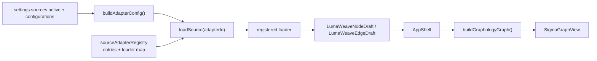

# LumaWeave — Source Adapter

Source adapters translate external formats into the normalized node and edge drafts consumed by the graph layer. The registry records both working loaders and candidate formats, so status and loader presence—not registry presence alone—determine capability.

## Runtime flow



`useGraphSourceSummary()` observes the active adapter and refresh token, invokes `loadSource()`, and publishes a `GraphSourceSummary`. `AppShell` renders normalized source nodes when a load succeeds and falls back to the generated self-graph fixture otherwise.

## Registry and loader boundary

`sourceAdapterRegistry.ts` contains:

- Typed adapter metadata.
- A mutable entry list.
- A loader map keyed by `adapterId`.
- Register/query helpers.
- Subscriptions used by UI registries.

Candidate entries use an error-returning no-op loader and cannot be activated from the source panel. Registered entries have real loader functions and configuration forms.

Committed `main` has registered loaders for:

- Self-graph YAML/frontmatter.
- Markdown vault.
- Cytoscape JSON.
- package.json dependency manifests.
- CSV edge lists.

Git/codebase, website, OpenAPI, database-schema, cloud-infrastructure, and issue-tracker entries are candidates rather than implementations.

## Adapter SDK

The common contract lives in `baseSourceAdapter.ts`:

- `BaseSourceAdapter` defines identity, capabilities, validation, and load behavior.
- `DirectoryAdapter` wraps bounded Tauri directory enumeration and vault-file reads.
- `SingleFileAdapter` wraps explicit user-file reads.
- `AdapterConfig` is a discriminated union keyed by `adapterId`.
- `LoaderFn` returns a `GraphSourceSummary`.

Adapter-specific forms register through `adapterConfigFormRegistry.ts`. Saved configurations live under `settings.sources.configurations`.

## Safety boundaries

Source-specific data must be normalized at the adapter boundary. Downstream graph code must not depend on Markdown, Cytoscape, CSV, package-manager, or future adapter shapes.

Tauri provides separate read paths:

- Project-scoped reads canonicalize and remain under the project root.
- Directory traversal skips symlinks, caps depth, filters extensions, and returns relative paths.
- User-selected single-file reads reject symlinks and non-regular files.
- Vault reads re-check that each relative path remains inside its configured root.

Adapters also declare node/edge/file/depth/time limits. Those declarations do not enforce themselves; each loader must apply relevant bounds and return warnings or errors rather than silently truncating without evidence.

## Implemented adapter behavior

### Self-graph

The self-graph is generated from `docs/` and `src/` by `scripts/generate-self-graph.mjs`. The loader reads the generated fixture and adapts it to normalized drafts. Vite regenerates the fixture during development when documentation changes.

### Markdown vault

Walks configured Markdown files, parses frontmatter and inline tags, resolves wiki links by path/name/alias, emits tag relationships, and reports unresolved or ambiguous references.

### Cytoscape JSON

Accepts nested element objects and flat element arrays, preserves supplied positions/classes and source data, deduplicates nodes, and warns when edges reference missing nodes. Cytoscape Desktop session format is rejected explicitly.

### Package dependencies

Currently implements npm-style `package.json` only. It creates one project node, dependency nodes, and production/development/peer edges. Workspace traversal and Cargo/Python/Go manifests are not implemented even though broader patterns exist in registry metadata/UI.

### CSV edge list

Parses RFC-4180-style quoted fields, supports header names or numeric columns, optional relationship labels, self-loops, bounded warnings, and partial loads for malformed rows.

## Adding an adapter

1. Define a discriminated configuration type.
2. Implement a `DirectoryAdapter`, `SingleFileAdapter`, or direct base adapter.
3. Normalize to `LumaweaveNodeDraft`/`LumaWeaveEdgeDraft`.
4. Register the loader and metadata.
5. Register a configuration form when user input is required.
6. Enforce declared limits in the loader.
7. Add representative fixtures, error cases, and targeted tests.
8. Promote status only when the runtime path and evidence exist.

## Current limitations

- Candidate catalog entries can look substantial despite having no loader; UI and docs must keep that distinction visible.
- Source onboarding and pre-load validation need further product polish.
- Package-manifest metadata overstates actual format coverage.
- Adapter QA reports are a design goal rather than a uniform emitted artifact today.
- Network-backed adapters need explicit credential, CORS/proxy, rate-limit, and data-minimization designs.

## Self-graph schema summary

Generated files use `lumaweave-self-graph/v1`:

```ts
type LumaSourceGraph = {
  schemaVersion: "lumaweave-self-graph/v1";
  metadata: {
    generatedAt: string;
    generator: string;
    sourceRoots: string[];
    stats: {
      nodeCount: number;
      edgeCount: number;
      nodesByType: Record<string, number>;
      edgesByType: Record<string, number>;
    };
  };
  nodes: LumaSourceNode[];
  edges: LumaSourceEdge[];
};
```

Nodes carry stable identity, type, labels, repository-relative path, cluster/status/tags, size, modification metadata, and optional raw visual hints. Edges carry source/target, relationship type, weight, directionality, provenance, and optional raw hints.

Identity prefers frontmatter `id` for documents and path-derived slugs otherwise. Structural `contains` edges connect synthesized directory/spine nodes; explicit references, Markdown links, wiki links, imports, and conservative tag overlap add semantic relationships.

The TypeScript source of truth is `src/fixtures/types.ts`; generator behavior is authoritative when this summary drifts.

## Code map

- Registry: `src/source-adapter/sourceAdapterRegistry.ts`
- SDK: `src/source-adapter/baseSourceAdapter.ts`, `directoryAdapter.ts`, `singleFileAdapter.ts`
- Adapters/forms: `src/source-adapter/adapters/`
- Dispatch: `src/graph/ingest/loadSource.ts`, `buildAdapterConfig.ts`, `useGraphSourceSummary.ts`
- Normalized schema: `src/graph/schema/graph.types.ts`
- Self-graph generator/types: `scripts/generate-self-graph.mjs`, `src/fixtures/types.ts`
- Desktop reads: `src-tauri/src/fs.rs`
- Tests: adapter-specific specifications under `tests/e2e/`
