# LumaWeave — Theme & Token System

How LumaWeave themes everything you see: the token model, how a theme reaches the screen, how users override colors, and how to add or extend themes safely.

**Supersedes:** `THEME_SYSTEM_OVERVIEW.md`, `THEME_ENGINE.md`, `THEME_TOKEN_PATH_MAP.md`, `THEME_TOKEN_COMPATIBILITY.md`, `THEME_PRESET_MODEL.md`, `THEME_OVERRIDE_STORAGE_CONTRACT.md`, `THEME_TARGET_REGISTRY.md`, `THEME_MAPPING_PANEL_ENTRY_CONTRACT.md`, `THEME_TOP_BAR_CONTROLS.md`, `TOP_BAR_CONTROL_PLAN.md`, `GRAPH_THEME_*_CONTRACT.md` (theme-token portions)

---

## §1 — What it is

The theme system turns a single user choice — which theme is active, plus any per-element color overrides — into every color, spacing, and motion value rendered across the app and the graph. It is a **token system**: nothing in the UI hardcodes a color; everything reads a named token, and the active theme decides what that token resolves to.

There are six built-in themes (`solar-plasma` is the default and reference: dark sci-fi, cyan/gold plasma; plus `obsidian-aurora`, `midnight-loom`, `void-circuit`, `agartha-dream`, `agartha-dusk`). Switching themes crossfades colors over 300ms in perceptual color space. Users can override any themed color globally, per element-kind, or per individual element, and those overrides persist locally.

**Mental model:** the active theme is a set of values; tokens are named slots; components read slots; a governance check at boot guarantees no slot is ever undefined or wired wrong.

---

## §2 — The parts & how they connect

The system has two token representations that serve different jobs, plus a runtime apply path.

### The authored tier model (governed abstraction)

Three tiers, resolved top-down. Authoring/extension adds at the top; resolution walks down.

```mermaid
flowchart TD
    C["Tier 3 — Components (tokenComponents.ts)<br/>theme-AGNOSTIC slots<br/>e.g. panel.border, tile.handle"]
    S["Tier 2 — Semantics (tokenSemantics.ts)<br/>per-theme ROLE assignments<br/>e.g. surface.border.accent"]
    P["Tier 1 — Primitives (tokenPrimitives.ts)<br/>per-theme RAW values<br/>e.g. color.gold.500 = #FFB347"]
    C -->|"references {role}"| S
    S -->|"references {color.x.y}"| P
    P --> V["concrete value (+ optional / NN% alpha)"]
    style C fill:#1a2a3a,stroke:#4a9
    style S fill:#1a2a3a,stroke:#4a9
    style P fill:#1a2a3a,stroke:#4a9
```

- **Tier 1 Primitives** — the raw vocabulary, redefined per theme (`color.void.900`, `space.4`, `duration.base`). Each theme supplies its own primitive set.
- **Tier 2 Semantics** — role assignments, per theme. Every value is a reference to a Tier 1 primitive via `{color.gold.500}` syntax, with optional alpha as `{color.gold.500} / 32%`.
- **Tier 3 Components** — component-family slots (`panel.border`, `inspector.radial.halo`). These are **theme-agnostic** — defined once, reference only Tier 2 roles, identical across themes. The theme variance lives entirely below them.

**The rule:** components never reference primitives directly; semantics never inline raw values. Each tier references exactly the tier below.

### The flat runtime tokens (what the renderer actually consumes)

Alongside the tier model, each theme has a flat `ThemeRuntimeTokens` object (`themeTokens.ts`) with concrete values grouped as `app` (background, panelBackground, panelBorder, textPrimary, textMuted, accent, glow), `graph` (node/edge/label colors + `nodeColorScale`/`edgeColorScale` arrays), `effects` (glitter, starfield, glow intensity), and `inspector`. This is the resolved, ready-to-render form the React tree reads. The tier model is the governed source of design intent; the flat runtime tokens are the consumed form. Governance (below) enforces that every theme's runtime tokens satisfy the canonical token paths.

### How a theme reaches the screen

```mermaid
flowchart TD
    Sel["settings.appearance.theme"] --> Memo["AppShell: getThemeRuntimeTokens(themeId)<br/>(useMemo — only re-runs on theme change)"]
    Memo --> CF["useCrossfadeAppTokens(tokens, reduceMotion)<br/>300ms rAF OKLCH interpolation of app colors"]
    CF --> Ovr["useResolvedTargetColor(targetId, tokenPath, fallback)<br/>applies per-target overrides"]
    Ovr --> CSS["AppShell writes ~25 --lw-* CSS custom properties<br/>onto the root style object"]
    CSS --> DOM["components read var(--lw-*) + data-lw-theme-target attrs"]
    RM{"reduceMotion?"}
    CF -.->|true: snap instantly| RM
    style CF fill:#2a2a3a,stroke:#88a
    style CSS fill:#1a3025,stroke:#4a8
```

`AppShell.tsx` is the apply bridge — there is no central `applyTheme()` function that mutates the DOM. (`applyTheme.ts` holds only two convenience getters.) AppShell reads the active theme, memoizes its runtime tokens, crossfades the `app` colors, resolves overrides for key targets, and writes the `--lw-*` custom properties onto the root element's style. Components consume those variables through CSS and carry `data-lw-theme-target` attributes (`app.shell`, `topbar.root`, `graph.frame`) that mark them as override targets.

---

## §3 — How to work in it safely

### Invariants (boot-enforced)

`assertThemeTokenGovernanceClean()` runs at boot and **hard-throws** on any of five conditions. Treat these as the laws of the system:

```mermaid
flowchart TD
    G["assertThemeTokenGovernanceClean() — boot"] --> A["1 · active target uses a non-canonical token path"]
    G --> B["2 · active target references a planned-only path"]
    G --> C["3 · planned target declares tokenBindings prematurely"]
    G --> D["4 · a built-in preset is missing a canonical token path"]
    G --> E["5 · tier-walk violation: inline value, or a tier references the wrong tier"]
    A & B & C & D & E --> T["throws — app refuses to boot"]
    style G fill:#3a1a1a,stroke:#a44
    style T fill:#3a1a1a,stroke:#a44
```

- **Canonical paths only.** Token paths live in `themeTokenPaths.ts` as `CANONICAL_*` (live) and `PLANNED_*` (reserved, not yet usable). An active target may bind only canonical paths.
- **No tier-skips, no inline values.** Tier 3 must reference a real Tier 2 role; Tier 2 must reference a real Tier 1 primitive. A raw value in Tier 2/3, or a reference to a nonexistent role/primitive, throws.
- **Planned stays planned.** A target marked `planned` must not declare `tokenBindings` until promoted to `active`.

### Dependencies & order

- Theme application is **not** a global mutation — it is React render flow through AppShell. A change to the active theme or an override re-renders via memo + the crossfade hook; it does not imperatively repaint.
- The crossfade only animates the `app` color group. Graph tokens and effects switch on the same render but are not interpolated frame-by-frame.
- Reduce-motion (`settings.appearance.reduceMotion`) short-circuits the crossfade to an instant snap — values still resolve, motion is skipped.

### Frontend connection

- The bridge is `AppShell.tsx` writing `--lw-*` properties. To make a new surface themeable: give it a stable `data-lw-theme-target` id, consume `var(--lw-*)` in its styles, and (if it needs override support) resolve its color through `useResolvedTargetColor`.
- Override reactivity is delivered by a `lw:override-change` window event (chosen over a module-level store specifically to survive Vite HMR module-boundary splits). Components using `useResolvedTargetColor` re-render on that event.

### Gotchas

- **Two token representations coexist.** Edit the tier files for design intent and governance; edit the flat `themeTokens.ts` for what actually renders. They must stay consistent — governance checks presets against canonical paths, but does not auto-sync the two. Don't edit one and assume the other follows.
- **OKLCH migration is partial.** Crossfade interpolation is OKLCH-correct (`colorMath.ts` via culori; `colorInterpolation.ts` delegates to it, legacy hex math kept `@deprecated` for rollback). But **palette generation from a hue anchor (`paletteGeneration.ts`) is still HSL** despite a header comment claiming otherwise. Trust the code, not the comment, and treat hue-anchor palette output as HSL-derived until that's migrated.
- **Override storage is localStorage-backed** (`lumaweave-theme-overrides`), versioned, with three scopes (global, target-kind, per-target). It can throw on save (quota/serialization) — callers handle that.

---

## §4 — How to extend it

**Add a built-in theme:** supply a primitive set (`tokenPrimitives.ts`), a semantic set (`tokenSemantics.ts`) referencing those primitives, a flat `ThemeRuntimeTokens` (`themeTokens.ts`) satisfying every canonical path, register it in `themePresets.ts`, and add the `ThemeId`. Boot governance will reject the theme if any canonical path is missing or any tier reference is broken — that's the safety net telling you the theme is incomplete.

**Add a themeable surface:** stable `data-lw-theme-target` id → consume `var(--lw-*)` → resolve via `useResolvedTargetColor` if it needs overrides. If it needs a *new* token path, add it to `CANONICAL_THEME_TOKEN_PATHS` first (or it'll throw as non-canonical).

**Promote a planned target/path:** flip `planned` → `active` in the same pass you add its bindings; never leave an active target pointing at a planned path.

---

## §5 — How it's designed to grow

- **Theme-as-code.** `defineTheme()` is a pure function (one side effect: lineage append) that builds a `ThemePreset` from a definition and computes its content hash. It does **not** auto-register — the caller decides. This is the seam for user-authored and generated themes: anything that can produce a `ThemeAsCodeDefinition` can mint a theme.
- **Content-addressable identity.** `themeHash.ts` produces a SHA-256 over normalized token values (`crypto.subtle`, async). Two themes with identical values hash identically — the basis for dedup, lineage integrity, and "has this theme changed" checks.
- **Lineage.** `themeLineage.ts` keeps an append-only derivation history per theme; built-in themes are origins (empty lineage). Deriving theme B from theme A appends an entry — the growth axis for a theme-remix ecosystem.
- **Palette generation.** `generatePaletteFromHue()` produces a full primitive set from one hue anchor, with family naming mirroring the built-ins for drop-in compatibility. (HSL today; OKLCH is the intended upgrade.) `colorSuggestionEngine` rotates perceptually-distinct colors per use-category with WCAG-aware selection.
- **Accessibility.** `themeAccessibilityProfile.ts` computes WCAG 2.1 contrast results for the key text/background pairs of any theme (cached, subscribable); `wcagContrast.ts` is the luminance math (APCA is a designed future addition). A generated or user theme can be scored for contrast before it ships.
- **Target discovery.** `themeTargetHeuristics.ts` runs a DOM probe that finds themeable surfaces by structural signals (registered `data-lw-theme-target` attrs, structural classnames, landmark testids; minimum 3 signals to qualify). This is how the theme-target inspector grows to cover new surfaces without hand-registering each one.

Scaling effects: adding a theme is O(1) on the system — governance guarantees it can't half-integrate. Adding a canonical token path widens every theme's obligation (each must define it) — a deliberate cost that keeps themes complete. Adding override targets composes freely; overrides resolve per-target at render with no global recompute.

---

## §6 — Where it lives in code

All under `src/themes/` unless noted.

- **Tier model:** `tokenPrimitives.ts` (T1), `tokenSemantics.ts` (T2), `tokenComponents.ts` (T3)
- **Runtime tokens:** `themeTokens.ts` (flat per-theme values + `getThemeRuntimeTokens`, `resolveGraphVisualTokens`, `validateThemeTokens`)
- **Paths & governance:** `themeTokenPaths.ts` (canonical/planned path sets + `validateThemeTokenPaths`), `themeTokenGovernance.ts` (`runThemeTokenGovernanceChecks`, `assertThemeTokenGovernanceClean`)
- **Apply path:** `AppShell.tsx` (the `--lw-*` bridge), `themeCrossfade.ts` (`useCrossfadeAppTokens`), `colorInterpolation.ts` + `colorMath.ts` (OKLCH), `applyTheme.ts` (getters only)
- **Presets & types:** `themePresets.ts` (six built-ins), `theme.types.ts`, `defineTheme.ts`
- **Overrides & targets:** `themeOverrideStorage.ts` (localStorage, 3 scopes), `useResolvedTargetColor.ts` (hook + `lw:override-change` event), `themeTargetRegistry.ts` (active/planned targets), `themeTargetHeuristics.ts` (DOM probe), `themeInspectorStore.ts`
- **Satellites:** `paletteGeneration.ts`, `colorSuggestionEngine.ts`, `themeSelectableColors.ts`, `themeLineage.ts`, `themeHash.ts`, `themeAccessibilityProfile.ts`, `wcagContrast.ts`, `themeThumbnail.ts`, `typographyRegistry.ts`, `fontAxisRegistry.ts`, `provenanceRegistry.ts`
- **Settings bridge:** `control-plane/settings/settings.schema.ts` (`ThemeId`, `appearance.theme`, `appearance.reduceMotion`)
