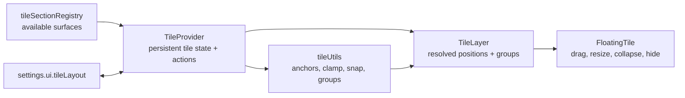

# LumaWeave — Tile & Layout Workspace

The workspace presents registered control surfaces as persistent, movable tiles over the graph viewport. The current implementation is custom React pointer/geometry code; `react-grid-layout` and `react-moveable` are not dependencies and are not the runtime.

## Architecture

### Section registry

Each entry identifies a surface, label, category, component, default visibility, default dimensions, and anchor. Registry identity connects the status-bar tile picker, persistent layout state, and rendered content.

### Provider

`TileProvider` reads and writes `settings.ui.tileLayout`. It exposes actions for creating, updating, hiding, raising, anchoring, grouping, and restoring tiles. Default-visible sections reconcile into the layout without resurrecting entries the user explicitly hid.

### Position modes

- **Docked:** position is derived from an edge/slot anchor and the current viewport.
- **Floating:** explicit x/y coordinates are persisted and clamped into the viewport.

Changing a docked tile through direct drag first seeds its resolved coordinates into floating state, avoiding jumps back to stale positions.

### Snapping and groups

Drag calculations run on a grid and compare the moving rectangle with live tile rectangles. A snap guide appears only while a valid target is armed. On drop, explicit `groupId` membership is reconciled:

- Flush-adjacent tiles may form or join a group.
- Pulling a tile beyond break tolerance removes it.
- One-tile groups dissolve.
- Group bars move, collapse, or close the group.
- Resize reflows adjacent group members.

Positions determine when membership changes, but `groupId`—not incidental overlap—is the persisted source of truth.

## Runtime invariants

- Settings are the persistent source of tile geometry and visibility.
- Event handlers read live store state rather than stale render snapshots.
- Docked positions are derived consistently before group, snap, and render calculations.
- Hidden tiles do not participate in group geometry.
- Floating tiles are clamped when the viewport changes.
- Active interaction raises a tile's z-order.
- Snap guides and group outlines are pointer-transparent.
- Status-bar popovers remain above the tile layer through explicit stacking levels.

## Extending the workspace

To add a surface:

1. Implement a self-contained tile content component.
2. Register it in `tileSectionRegistry.ts`.
3. Choose conservative default size, visibility, and anchor.
4. Add stable test IDs where browser interaction needs evidence.
5. Verify bootstrap/reconciliation does not resurrect a hidden tile.
6. Exercise dock, float, resize, snap, group, collapse, hide, and reload behavior as relevant.

Geometry changes belong in `tileUtils.ts` and tile state/actions, not in content components.

## Minimap relationship

The minimap is a separate fixed overlay with its own settings, drag/resize behavior, canvas snapshot, viewport projection, click/drag navigation, and wheel zoom. It is implemented under `src/graph/overlay/`; it is not a tile and does not use tile grouping.

## Future direction

- Saved/named workspace profiles built over `tileLayout`.
- Explicit import/export of workspace state.
- Better keyboard accessibility for move/resize operations.
- Navigation lenses that coordinate workspace, camera, filters, and physics.

The lens registry is currently a seam, not a populated navigation system.

## Code map

- Registry: `src/control-plane/panels/tileSectionRegistry.ts`
- State/actions: `TileProvider.tsx`, `tile.types.ts`
- Rendering: `TileLayer.tsx`, `FloatingTile.tsx`
- Geometry: `tileUtils.ts`
- Minimap: `src/graph/overlay/Minimap*.tsx`, `useMinimap*.ts`
- Tests: `tests/e2e/v86c-tile-system.spec.ts`, `tileDocking.spec.ts`, `tileStateConsistency.spec.ts`
