# LumaWeave — Tile & Layout Workspace

How LumaWeave's panels become a rearrangeable workspace: any panel section can be "torn off" into a floating, draggable, snapping tile; tiles group, dock to edges, and persist their positions. Also covers the navigation lens system (designed, not yet built) and the minimap.

**Supersedes:** `TILE_WORKSPACE_SYSTEM.md`, `LENS_NAVIGATION_MODEL.md`, `Minimap_Integration.md`

---

## §1 — What it is

The workspace lets a user pull any registered panel section out of its docked home and into a **floating tile** they can drag, resize, snap to edges, and group with other tiles. Tiles remember where they were put. It turns a fixed panel layout into a user-arrangeable surface — the foundation for the "build your own cockpit" experience.

A **tile section** is a unit that can be torn off (the physics controls, the inspector, graph sources, the QA panel, etc.). A **floating tile** is a torn-off section rendered as a positioned overlay. The **tile provider** holds all tile state and the actions to manipulate it; the **tile layer** renders the floating tiles over the app.

**Mental model:** the section registry is the catalog of what *can* float; the provider is the live state of what *is* floating and where; the layer draws them; anchors + snapping decide where they settle.

---

## §2 — The parts & how they connect

```mermaid
flowchart TD
    REG["tileSectionRegistry<br/>catalog of tear-off-able sections<br/>(physics, inspector, sources, qa, ...)"] --> PROV
    PROV["TileProvider (context)<br/>tile state + actions:<br/>tileOut / updateTile / group / anchor / slide"] --> LAYER
    LAYER["TileLayer<br/>renders floating tiles + groups<br/>+ snap-guide overlay"] --> FT["FloatingTile<br/>drag / resize / collapse / close<br/>header + ungroup grip"]
    PROV --> ANCHOR["anchors (left/right/top/bottom/free)<br/>+ snap grid (16px) + edge magnetism (75px)"]
    style PROV fill:#2a2a3a,stroke:#88a
    style REG fill:#2a2440,stroke:#96c
```

**Tile section registry** (`tileSectionRegistry.ts`) — a registry (RegistryContract shape) of sections that can become tiles, each with an `id`, `category` (left-panel / control-dock / right-panel), and the source slot's testid. ~12 sections registered (physics, appearance, labels, typography playground, graph sources, graph inspector, agent chat, qa feedback, visual inventory, system index, command deck, source adapter).

**Tile provider** (`TileProvider.tsx`) — React context holding tile state (`TileLayoutEntry` per tile: position, size, anchor, collapsed, z, group) and the actions: `tileOut` (section → floating tile), `updateTile` (position/size during drag), grouping, `setAnchor`/`slideToAnchor`. Also holds the live snap-guide state.

**Tile layer** (`TileLayer.tsx`) — renders all visible floating tiles and tile groups as positioned overlays, plus the snap-guide preview during drag.

**Floating tile** (`FloatingTile.tsx`) — one tile: a header (drag handle, collapse, close, ungroup grip), body, and resize grip. Pointer handlers drive drag/resize and `bringToFront` on mousedown.

**Anchors & snapping** — a tile's `TileAnchor` is an edge (`left`/`right`/`top`/`bottom`) or `free` (explicit x/y). Snap grid is 16px; edge magnetism tolerance is 75px (strong magnetic snap to edges). Tiles slide to their anchor with a transition.

---

## §3 — How to work in it safely

### Known bug — floating tiles intercept graph-canvas clicks

The tile layer renders floating tiles as absolutely-positioned overlays above the graph viewport. The tile *surfaces* manage their own pointer events, but the layer/overlay can sit over the graph canvas and **intercept clicks meant for the graph** (selecting nodes, clicking the stage). This is the open click-interception bug — the same class as the earlier status-bar overlap. The fix (scheduled for the v101 tile migration to react-grid-layout + react-moveable) is to ensure the layer is pointer-transparent except where an actual tile is, so clicks fall through to the graph everywhere else. Until then: floating tiles can shadow graph interaction in their bounding region.

### Invariants

- **The provider is the single source of tile state.** Position/size/anchor/group/z all live there; components read context and call actions — they don't hold their own tile geometry.
- **A tile's persisted anchor is its home.** `free` tiles store explicit x/y; edge-anchored tiles slide back to their edge. Preserve the anchor model when moving tiles, or they lose their dock behavior.
- **Bring-to-front on interaction** — mousedown raises z; keep that so the active tile is reachable.
- **Sections are torn off by id** — the registry id is the contract between a docked slot and its floating form.

### Dependencies & frontend connection

- The tile layer overlays the app shell / graph viewport; z-index ordering separates tiles, groups, and the snap-guide (which sits at a high z, pointer-transparent).
- Tile *content* is the registered section's component (e.g. `PhysicsSectionContent`, `GraphInspectorTileContent`) — the tile is the frame, the section is the payload. The `*TileContent.tsx` wrappers bridge a panel section into a tile body.
- Tiles are theme-consumers like any surface (see the Theme doc); note tile CSS theming wiring is a known medium-priority gap (tiles use some hardcoded CSS rather than fully obeying tokens).

### Gotchas

- The pointer-interception bug above is the big one — assume floating tiles can shadow the graph until v101 lands.
- Snap/magnetism constants (16px grid, 75px edge tolerance) live in `tile.types.ts` — tune there, not inline.

## §4 — How to extend it

**Make a panel section tear-off-able:** register it in `tileSectionRegistry.ts` (id, category, source slot testid, default anchor) and provide a `*TileContent.tsx` wrapper that renders the section in a tile body. It then appears as a floating option and round-trips through `tileOut`.

**Add a tile action:** extend `TileContextActions` in the provider; keep all geometry mutations going through the provider so state stays single-sourced.

**Adjust snapping/anchoring:** change the constants/anchor logic in `tile.types.ts` + the snap-target search in `FloatingTile`/`TileLayer`; don't scatter geometry math into components.

## §5 — How it's designed to grow

- **The v101 tile migration** moves the hand-rolled drag/snap/group system onto `react-grid-layout` + `react-moveable`, which is also where the click-interception bug gets fixed structurally (a real grid/overlay system with proper pointer pass-through) rather than patched. The section-registry + provider model survives the migration; the rendering/interaction layer is what changes.
- **Lens navigation (designed, not built).** `lensRegistry` is a Tier-2 registry that's currently an **empty stub** — it defines `LensEntry` (a layout function reference + suggested settings + compatible physics dialects) but registers nothing ("v93 implements"). The intent: named viewing lenses that combine a layout, settings, and compatible Gwells dialects, so a user switches the whole graph presentation with one choice. The seam exists; the lenses don't yet.
- **Tile theming** grows toward full token obedience (closing the hardcoded-CSS gap) so tiles restyle with the active theme like every other surface.
- **Workspace persistence** scales from per-session tile positions toward saved/named layouts — the anchor + group model is the foundation a saved-workspace feature builds on.

## §6 — Where it lives in code

Under `src/control-plane/` (tiles/panels) unless noted.

- **Tile system:** `TileProvider.tsx` (state + actions context), `TileLayer.tsx` (overlay renderer), `FloatingTile.tsx` (single tile), `Tile.tsx`, `tileSectionRegistry.ts`, `tileUtils.ts`, `tile.types.ts` (model + snap/anchor constants), `TiledOutIndicator.tsx`
- **Tile content wrappers:** `*TileContent.tsx` (graph inspector, sources, qa, system index, source adapter, command deck, etc.)
- **Panels:** `CollapsiblePanel.tsx`, `CollapsibleSection.tsx`, `panel.types.ts`
- **Lens (stub):** `lensRegistry.ts`
- **Minimap:** `Minimap.tsx` (prototype-grade; integration is a roadmap item)
- **Tests:** `tests/e2e/v86c-tile-system.spec.ts`
