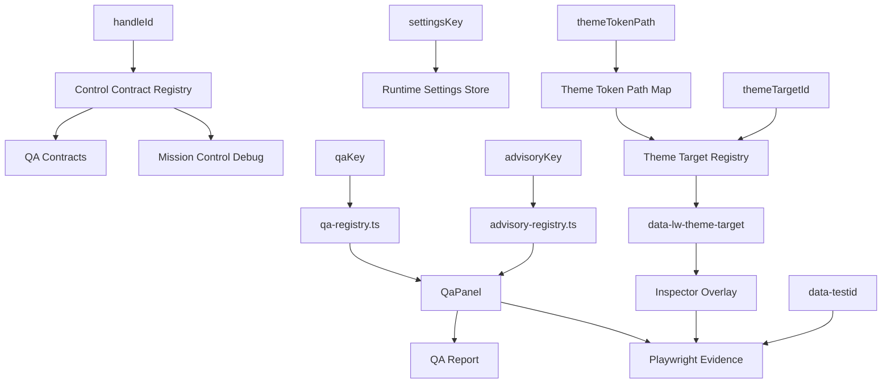

# Identity System Graph

## Reading The Graph

- `themeTokenPath` is value vocabulary.
- `themeTargetId` is surface identity.
- `data-lw-theme-target` is runtime DOM evidence.
- `data-testid` is Playwright access evidence.
- `qaKey` and `advisoryKey` are related but distinct contract selectors.
