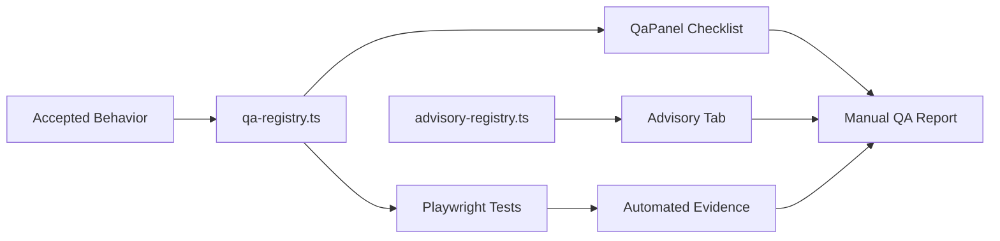

# QA Contract Pipeline

## Contract Meaning

QA artifacts are not just UI text.

They preserve:

- what was accepted
- what was incomplete
- what must remain stable
- what future work may extend
- what tests prove

## Rule

Do not delete or rewrite QA/advisory artifacts during recovery unless the pass explicitly authorizes a contract migration.
