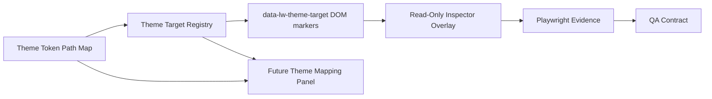

# Theme Contract Pipeline

## Contract Meaning

The v19/v20 theme work is building a future-safe foundation:

1. `ThemeTokenPath` defines the allowed token vocabulary.
2. `ThemeTargetRegistry` defines inspectable surfaces.
3. `data-lw-theme-target` binds registered targets to real DOM nodes.
4. The read-only overlay proves the mapping can be inspected.
5. Playwright verifies that the evidence exists.
6. QA records the accepted/incomplete state.
7. Future Theme Mapping Mode can add editing without inventing new IDs.

## Do Not Confuse

- Token paths are not target IDs.
- Target IDs are not test IDs.
- DOM markers are not arbitrary styling hooks.
- Future mapping placeholders are not active controls.
